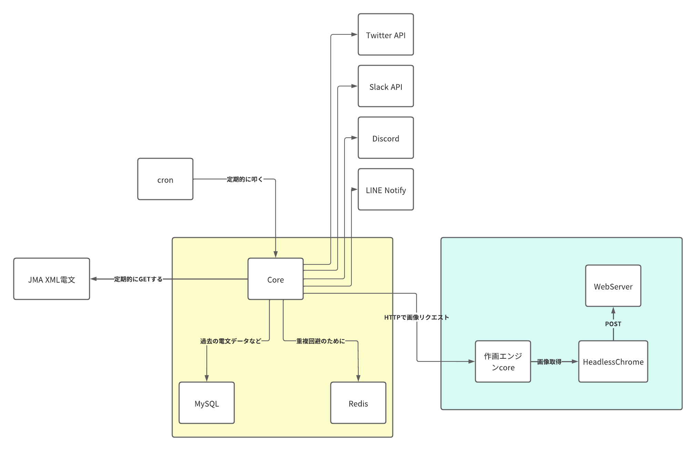

# erarthquake-alert-v2

WIP: New Earthquake alert

## 考えていること

- 実行環境
  - すべてコンテナに入れることができるようにする
  - `docker-compose`
- Earthquake Alert V1との違い
  - MySQLとRedisを追加。多分パフォーマンス上がる
  - 画像データもMySQLにバイナリで突っ込みたい
  - Seleniumを経由してHeadless Chromeを使うのではなく、直接扱いたい
  - 作画エンジン部分はすべて別コンテナにしてPOSTするだけで画像を生成できるようにしたい
    - WebサーバとHeadless Chromeにリクエスト出す部分の2つ必要
  - 管理画面を作りたい
    - `localhost:3000`あたりでアクセスできるようにしたい
      - これは後々
  - Goで書く
    - ちゃんとテストも書こうね
  - クラウドサービスにデプロイできるようにしたい
    - Redisがあるのでやらないとは思うけど、CloudRunとかにおいておいたら以外といいのではないだろうか
- 夢
  - 震度観測点をいい感じに自動取得したい
    - 手動めんどくさい
    - [気象庁｜震度データ](https://www.data.jma.go.jp/eqev/data/bulletin/shindo.html) から取れるようになってそう
    - 1日おきに非同期で更新させる

## TODO

- [ ] coreの下地作成
  - [ ] cronで叩くため、Webサーバとして動作させたい
- [ ] MySQLセッティング
- [ ] Redisセッティング
- [ ] 作画エンジンの作成
  - [ ] `earthquake-map-v2`でやる
- [ ] core書く
- [ ] 震度観測点のデータ取得も組み込みたい
  - [ ] データはMySQLかRedisに入れるとして定期的に更新できるようにする
