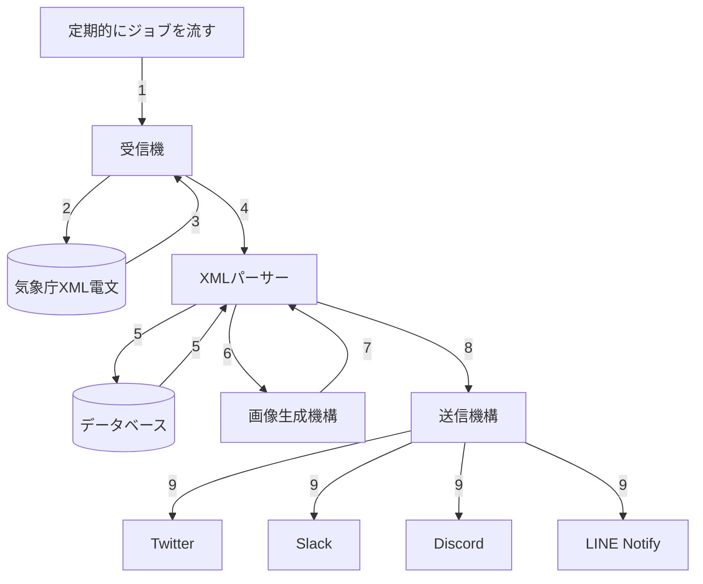

# 開発者向けドキュメント

## はじめに

このドキュメントは[`earthquake-alert-v2`](https://github.com/earthquake-alert/earthquake-alert-v2)に対してコントリビュートをしていただけるような方向けに、構造や使用しているパッケージ、スクリプトの使用法などをまとめたドキュメントです。

開発者だけでなく、「プログラミングはあまりやったことないけど防災界隈が好き」という方にも理解いただけるように、できるだけ丁寧に書いています。

**お願い:** もし、このドキュメントでスペルミスなどを見つけた場合、GitHubを使用できるかたはPullRequestを出していただければ幸いです。もしくは、[お問い合わせページ](https://cateiru.com/contact?url=https://github.com/earthquake-alert/earthquake-alert-v2&category=%E3%83%89%E3%82%AD%E3%83%A5%E3%83%A1%E3%83%B3%E3%83%88%E3%81%AB%E3%81%A4%E3%81%84%E3%81%A6)でお問い合わせください。

## 連絡と使用について

開発者([cateiru](https://cateiru.com))に連絡を取りたい場合は、以下のフォームからお願いします。

[お問い合わせフォーム](https://cateiru.com/contact?url=https://github.com/earthquake-alert/earthquake-alert-v2&category=%E3%81%9D%E3%81%AE%E4%BB%96%E3%81%8A%E5%95%8F%E3%81%84%E5%90%88%E3%82%8F%E3%81%9B)

なお、このプロジェクトを使用して自分でTwitterBotを作成する、LINEのグループに流す、商用利用、ソースコードの一部を利用するなどは[MITライセンス](../LICENSE)に準拠していれば連絡は不要です。

著作権表示は`© 2022 cateiru`を、どこかに入れてください。場所は問いません。

## 特徴

`earthquake-alert-v2`は[`earthquake-alert`](https://github.com/earthquake-alert/earthquake-alert)の後継として開発されています。

なぜ、`v2`を作成したか、主に以下のような理由があります。

- Pythonで作成されており、パフォーマンスが良くない（速度的に遅い）
- Pythonは静的型付け言語ではないため気象庁のXML電文のパースなどがスパゲッティ状態になってしまっている
- 開発者自身、コロナ禍の深夜テンションのような状態で作成したものであり、現状メンテがしづらい
- 画像生成部分にChromeDriverを使用しているが、このプロセスが正常に終了せず、[ゾンビプロセス](https://e-words.jp/w/%E3%82%BE%E3%83%B3%E3%83%93%E3%83%97%E3%83%AD%E3%82%BB%E3%82%B9.html)として残ってしまうバグが存在
- テストが崩壊しており、動くのかは実行してみないとわからない
- なんとなく

新しい、`earthquake-alert-v2`では以下のような特徴があります。

- Go言語で記述されており、優れたパフォーマンスが期待できる
- Goは静的型付け言語であるため、気象庁XML電文などは構造をすべて定義し、未知のエラーを排除
- テストカバレッジ100% を目指している
- Webサーバーを使用することにより、並列で複数の動作が可能（震度観測点の自動更新など）
- 圧倒的にメンテがしやすい！！ ←ココ重要
- データはMySQLに保存することですぐに過去のデータにアクセスができる！

## 仕様

細かい仕様を解説していきます。

### 実行言語など

- 実行言語: **Go**
- データベース: **MySQL**
- 実行コンテナ: **Docker**
- コンテナオーケストレーション: **docker-compose**

### Goの使用しているパッケージなど

- `github.com/gin-gonic/gin`
  - Webサーバーで使用しています。
- `github.com/stretchr/testify`
  - テストを楽するために使用しています。
- `github.com/volatiletech/sqlboiler/v4`
  - データベースのORMで使用しています。
  - sqlboilerを選んだ理由として、SQLのスキーマ定義はSQL側で行いたかったというものがあります。
- `go.uber.org/zap`
  - ログで使用しています。

### 簡単な内部構造

